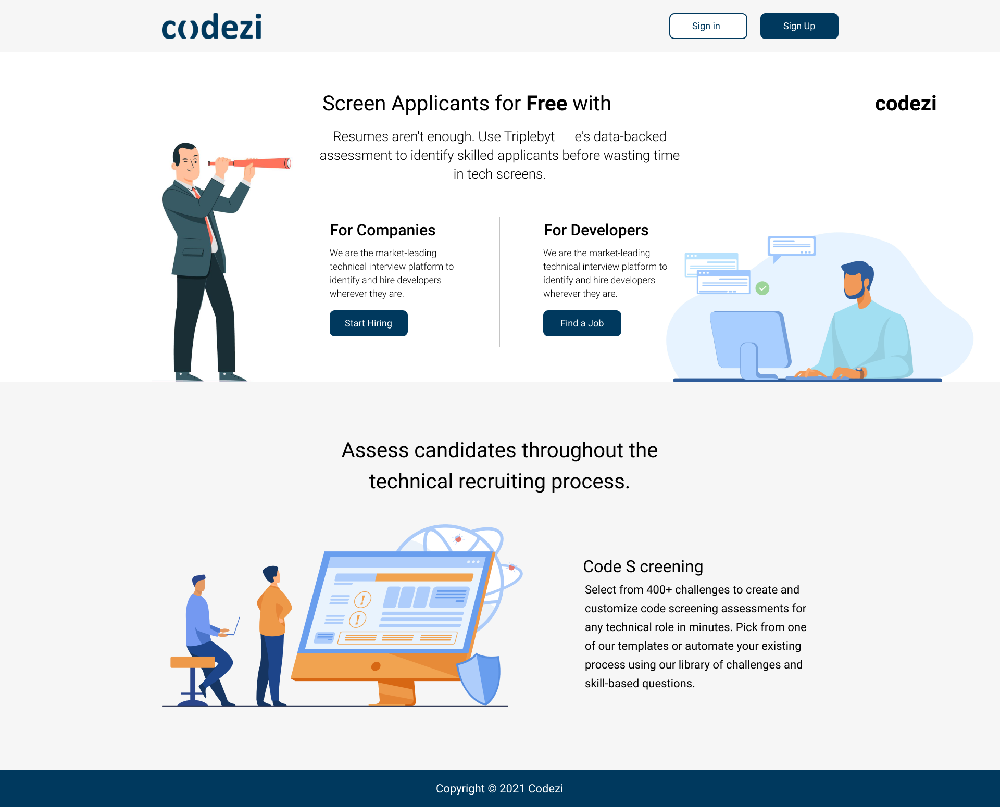

<!-- <h1 align="center">Codezi</h1>-->
<p align="center">
        
        <h4 align="center">Codezi is a unique Screen Applicants platform for Free.</h4>

Resumes aren't enough. Use Triplebyte's data-backed assessment to identify skilled applicants before wasting time in tech screens. <br /> <br />
Welcome! we hope you enjoy the site as much as we enjoyed making it. <br/>
</p>

## 🏢 Table of contents

-  [Demo](#%EF%B8%8F-demo)
-  [Installation](#%EF%B8%8F-installation)
-  [Technologies Stack](#%EF%B8%8F-demo)
-  [Authhors](#-authhors)
-  [Mentor](#-mentor)
-  [License](#license)
<!-- -  [Screenshots](#-screenshots) -->

## ▶️ Demo

Here you can find the demo links:

-  [Codezi](https://wizardly-brahmagupta-842dc6.netlify.app/)

### 👮‍ Test credentials

> Email: admin@codezi.com<br/>
> Password: Admin@123<br/>

## ⬇️ Installation

Requires [Node.js](https://nodejs.org/) to run (v14.15.0+).

Install the dependencies and open the terminal and then run the following command one by one.

```sh
$ git clone https://github.com/codezi-zeta/codezi.git
$ cd codezi
$ yarm
$ yarn start
```

## 🚀 Technologies Stack

\
\
\
\


## 👱 Authhors

<!-- ALL-CONTRIBUTORS-LIST:START - Do not remove or modify this section -->
<!-- prettier-ignore -->
<table>
  <tr>
     <td align="center"><a href="https://www.linkedin.com/in/rahil-memon-22221bb1"><br /><sub><b>Rahil Memon</b></sub></a><br /><a href="https://github.com/codezi-zeta/codezi/commits?author=codezi-zeta" title="Code">💻</a> <a href="https://github.com/codezi-zeta/codezi/commits?author=codezi-zeta" title="Documentation">📖</a> <a href="https://github.com/codezi-zeta/codezi/commits?author=codezi-zeta" title="Ideas, Planning, & Feedback">🤔</a> <a href="https://github.com/codezi-zeta/codezi/commits?author=codezi-zeta" title="Reviewed Pull Requests">👀</a> <a href="https://github.com/codezi-zeta/codezi/commits?author=codezi-zeta" title="Tests">⚠️</a></td>
  </tr>  
</table>

## 👨‍🏫 Mentor

<table>
  <tr>
     <td align="center"><a href="https://www.linkedin.com/in/gaurav-tiwari-b925b526/"><br /><sub><b>Gaurav Tiwari</b></sub></a><br /><a href="https://github.com/codezi-zeta/codezi/commits?author=codezi-zeta" title="Code">💻</a> <a href="https://github.com/codezi-zeta/codezi/commits?author=codezi-zeta" title="Documentation">📖</a> <a href="https://github.com/codezi-zeta/codezi/commits?author=codezi-zeta" title="Ideas, Planning, & Feedback">🤔</a> <a href="https://github.com/codezi-zeta/codezi/commits?author=codezi-zeta" title="Reviewed Pull Requests">👀</a> <a href="https://github.com/codezi-zeta/codezi/commits?author=codezi-zeta" title="Tests">⚠️</a></td>
  </tr>  
</table>


# License

[MIT](https://opensource.org/licenses/MIT)

<!-- ## 😄 Screenshots

<!--  -->
<p>

</p> -->


